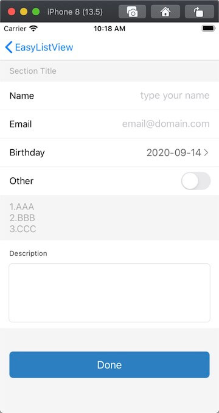
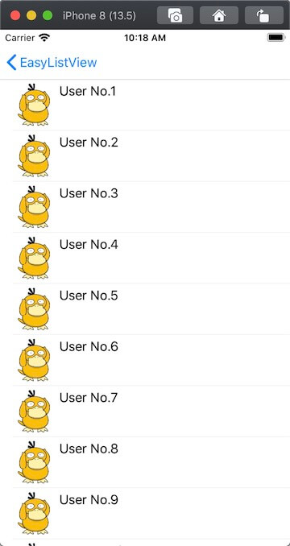
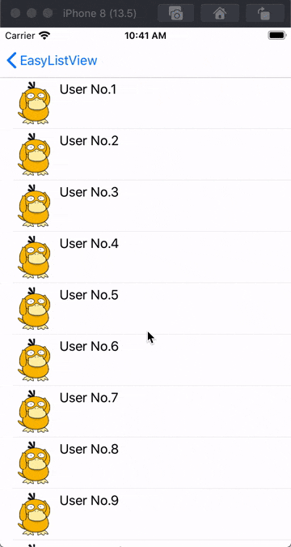

# EasyListView


## 快速搭建静态列表

#### 示例图

 

 


### 概述

使用系统的`UITableView`或`UICollectionView`实现可重用列表是最常规的做法，但是用于实现静态列表就会略显繁琐，既不能享受列表的重用，还要额外处理重用带来的数据显示问题。如果使用`Storyboard`,可以用`UITableViewController`的`Static Cells`实现，不过对于一些自定义的需求不太友好，所以作者基于自身的需求使用`UIScrollView`进行扩展，实现了一个快速搭建静态列表的方式`EasyListView`。

### 要求

- Swift 5.0 / Objective-C
- Xcode 11
- iOS 9.0+

### 使用

---

```
注意: EasyListView是通过约束实现自动布局的，支持高度自适应，请确保子视图添加了有效的约束（必要的高度约束或者intrinsicContentSize），以保证布局的正确性
```

##### Append

用于往列表中添加子视图，无动画效果

```swift
//添加一个UILabel
let label = UILabel()
label.text = "Title"
self.scrollView.easy.append(label)
```

```swift
//添加一个UILabel，与上一个视图间距16，并指定标识
let label = UILabel()
label.text = "Title"
self.scrollView.easy.append(label, for: "titleLabel", spacing: 16)
```

```swift
//添加一个UILabel，并指定四边间距
let label = UILabel()
label.text = "Title"
self.scrollView.easy.append(label, with: UIEdgeInsets(top: 10, left: 16, bottom: 10, right: 16))
```

##### Insert

用于往列表中插入子视图，带动画效果

* 插入到某个视图对象之后，如果该对象有指定标识，可以传入String标识找到

```swift
//在子视图label之后插入一个UITextField
let textField = UITextField()
self.scrollView.easy.insert(textField, after: label)
```

```swift
//在标识为"Title"的子视图之后插入一个UITextField
let textField = UITextField()
self.scrollView.easy.insert(textField, after: "Title")
```

* 插入到某个视图对象之前

```swift
//在子视图label之前插入一个UITextField
let textField = UITextField()
self.scrollView.easy.insert(textField, before: label)
```

```swift
//在自身UIScrollView之前插入一个UITextField，即在末尾插入子视图
let textField = UITextField()
self.scrollView.easy.insert(textField, before: self.scrollView)
```

##### Delete

删除指定视图对象，带动画效果

```swift
//删除label
self.scrollView.easy.delete(label, completion: nil)
```

```swift
//删除所有子视图
self.scrollView.easy.deleteAll()
```

##### BatchUpdate

批量更新，带动画效果，更新操作包括append(添加)和delete(删除)

```
//开始更新
func beginUpdates(option: EasyListUpdateOption = .animatedLayout)
//结束更新，带完成回调
func endUpdates(_ completion: (() -> Void)? = nil)
```

```swift
//执行更新前先调用beginUpdates
self.scrollView.easy.beginUpdates()

//更新操作：添加view1，删除view2和标识为"view3"的视图
self.scrollView.easy.append(view1)
self.scrollView.easy.delete(view2)
self.scrollView.easy.delete("view3")

//提交更新，beginUpdates和endUpdates必须成对使用
self.scrollView.easy.endUpdates {
    //完成回调
    print("Update Finish")
}
```

##### Disposable

动态回收机制：当视图滚动到屏幕外，将会被销毁回收内存；当重新滚动到屏幕内，将会重新创建并展示，类似于`UITableView`的重用

```swift
//用disposableView包装子视图
let view = self.scrollView.easy.disposableView {
    let label = UILabel()
	  label.text = "PsyDuck"

  	return label
}
//添加disposableView包装后的子视图
self.scrollView.easy.append(view)
```

```swift
//刷新数据
self.scrollView.easy.reloadDisposableData()
```

```swift
//使用系统或自定义的UIScrollView时，需要在scrollViewDidScroll回调方法中调用triggerDisposable来触发回收机制
//如果使用的是EasyListView对象，则无需调用
func scrollViewDidScroll(_ scrollView: UIScrollView) {
    self.scrollView.easy.triggerDisposable()
}
```

##### Getter

```swift
//获取指定标识的视图对象，包括静态视图和动态视图(处于屏幕外的动态视图可能返回nil)
let label = self.scrollView.easy.getElement(identifier: "myLabel")
label?.text = "UpdateText"
```

```swift
//获取指定下标的视图对象，仅限于动态视图
let view = self.scrollView.easy.getDisposableElement(at: 1)
```

```swift
//获取所有可见的动态子视图
let views = self.scrollView.easy.visibleDisposableElements
```

##### Other

```swift
//设置全局的内边距
self.scrollView.easy.coordinator.globalEdgeInsets = UIEdgeInsets(top: 20, left: 15, bottom: 20, right: 15)
```

```swift
//设置全局的间距
self.scrollView.easy.coordinator.globalSpacing = 10
```

```swift
//设置动画的持续时长
self.scrollView.easy.coordinator.animationDuration = 1
```

##### For Objective-C

提供了可供Objective-C调用的方法

```swift
//Objective-C请调用easy_前缀的方法
@objc var easy_coordinator: EasyListCoordinator
@objc func easy_appendView(_ view: ViewOrClosure)	
@objc func easy_insertView(_ view: ViewOrClosure, after element: Any)
@objc func easy_insertView(_ view: ViewOrClosure, before element: Any)
@objc func easy_deleteElement(_ element: Any)
@objc func easy_deleteAll()
@objc func easy_beginUpdates()
@objc func easy_endUpdates()
@objc func easy_disposableView(maker: @escaping () -> UIView) -> UIView
@objc func easy_reloadDisposableData()
@objc func easy_triggerDisposable()
@objc func easy_getElement(identifier: String) -> UIView?
@objc func easy_getDisposableElementAtIndex(_ index: Int) -> UIView?
@objc var easy_visibleDisposableElements: [UIView]
```

### 集成

##### CocoaPods

```ruby
pod 'EasyListView'
```

##### Swift Package Manager

```swift
dependencies: [
    .package(url: "https://github.com/moliya/EasyListView", from: "1.2.0")
]
```

### License

EasyListView is released under the MIT license. See LICENSE for details.